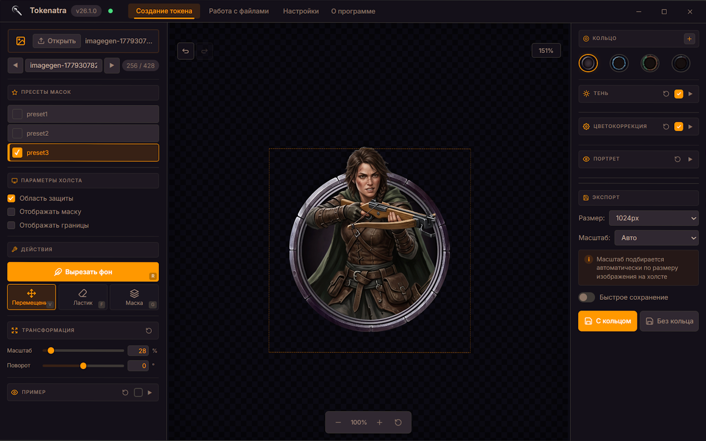
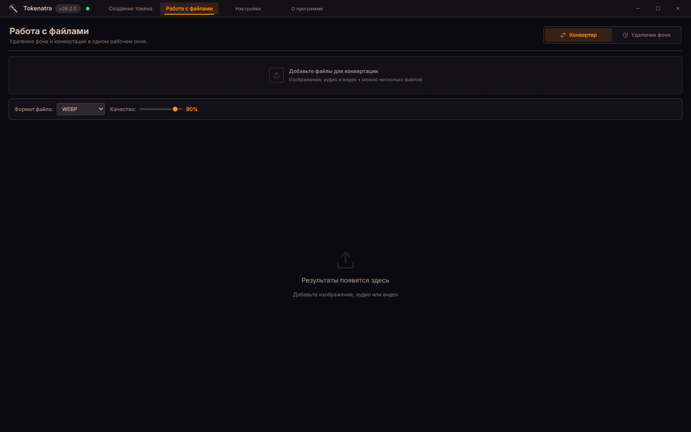
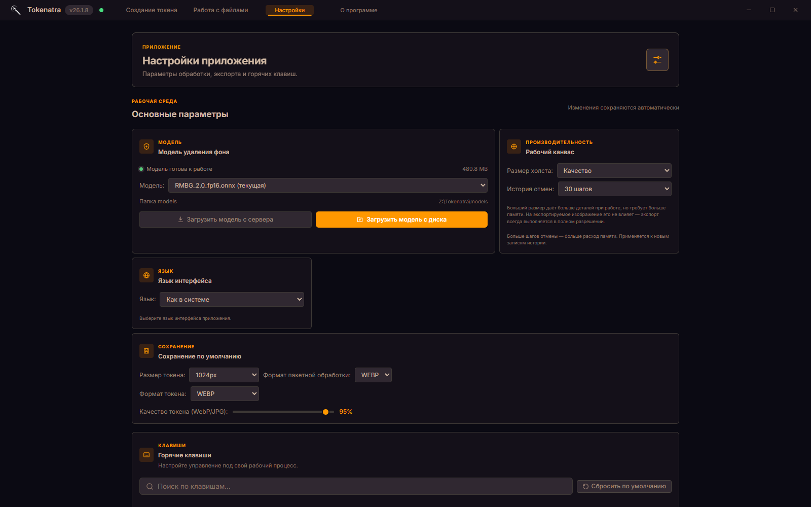
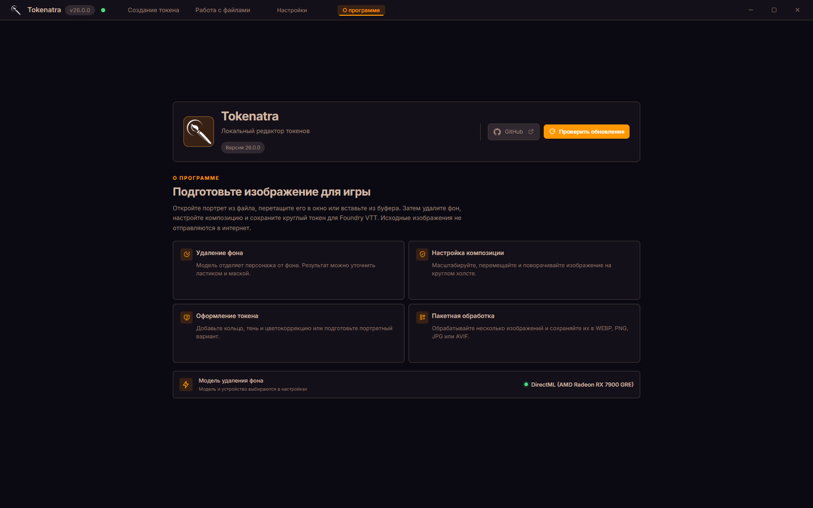

# Tokenatra

<p align="center">
  
</p>

<p align="center">
  Локальное приложение для Windows, macOS и Linux для создания токенов персонажей,<br>
  удаления фона и пакетной конвертации файлов.
</p>

<p align="center">
  <a href="#русский">Русский</a> ·
  <a href="#english">English</a>
</p>

---

## Русский

Tokenatra готовит картинки персонажей для Foundry VTT и других виртуальных игровых столов: вырезает из изображения круглый токен, убирает фон и конвертирует файлы. Всё работает локально — картинки не уходят в интернет, а фон вырезает ONNX-модель прямо на вашем компьютере.

## Скриншоты

### Редактор токенов



Здесь доступны загрузка изображения, круглый холст, пресеты масок, ручная доводка, кольца и настройки экспорта.

### Работа с файлами



Раздел объединяет конвертер и пакетное удаление фона. Поддерживаются изображения, аудио и видео.

### Настройки



В настройках можно выбрать модель, размер рабочего холста, язык, форматы сохранения и горячие клавиши.

### О программе



Экран «О программе» показывает версию, ссылку на репозиторий, текущую модель и устройство, на котором она запущена.

## Возможности

### Создание токенов

- Загрузка картинки файлом, перетаскиванием или из буфера обмена.
- Круглый холст на выбор: 1 536, 3 072 или 6 144 пикселя.
- Масштабирование, перемещение и поворот изображения.
- Удаление фона в один клик и просмотр исходника рядом.
- Ластик и розовая маска для ручной доводки.
- Пресеты масок и защита областей от случайного стирания.
- Подсветка зон обработки и границ экспортируемой области.
- Кольца из папки `token_rings/` плюс свои собственные.
- Тень: угол, смещение, размытие и прозрачность.
- Цветокоррекция: насыщенность и яркость.
- Пример-изображение для проверки масштаба и композиции.
- Портретный предпросмотр и сохранение портретного варианта.
- История действий с отменой и повтором.

### Свои кольца и защитные маски

При добавлении кольца можно указать файл «Защитная маска». Он необязателен: без него приложение использует стандартную `mask.png`.

Маска должна совпадать с кольцом по композиции и пропорциям. Она рисуется в центральной области кольца 1×: например, маска 2 048 × 2 048 соответствует рабочему холсту 6 144 × 6 144. Любой непрозрачный пиксель маски защищает соответствующую область изображения от ластика; прозрачные области остаются доступными для редактирования. Цвет пикселей значения не имеет. Лучше использовать PNG или WebP с прозрачностью.

Приложение сохраняет пользовательскую маску рядом с кольцом в папке пользовательских данных, например `silver.webp` и `silver.mask.png`. Такая маска автоматически выбирается вместе с кольцом. Если удалить пользовательское кольцо, его маска также будет удалена.

### Удаление фона

- Пакетная обработка сразу нескольких картинок.
- Результат в WEBP, PNG, JPG или AVIF.
- Качество сжатия и смягчение краёв маски.
- Сравнение «до/после».
- Копирование результата в буфер обмена.
- Отправка результата прямо в редактор токенов.
- Сохранение всей очереди в выбранную папку.

### Конвертер файлов

- Пакетная конвертация изображений, аудио и видео.
- Изображения: WEBP, PNG, JPG, AVIF, BMP, GIF и TIFF.
- Аудио и видео — в OGG через `ffmpeg`.
- Качество для поддерживаемых форматов.
- Сохранение отдельных файлов или всей очереди.

### Дополнительно

- Автовыбор CUDA, ROCm, DirectML или CPU.
- Ручной выбор GPU и ONNX-модели в настройках.
- Скачивание модели из окна настроек или с диска.
- Настраиваемые горячие клавиши.
- Контекстное меню Windows: удалить фон, конвертировать в WebP, аудио — в OGG.
- Проверка обновлений через GitHub Releases.
- Быстрое сохранение в заранее выбранную папку.

## Установка

Основной редактор токенов, конвертер файлов и удаление фона через локальную ONNX-модель
поддерживаются на Windows, macOS и Linux. Контекстное меню файлового менеджера и
автоматическая установка обновлений пока остаются функциями Windows.

Установить Tokenatra можно из готового установщика или запустить из исходников.

### Готовый установщик

1. Откройте [раздел Releases](https://github.com/SweetyHake/Tokenatra/releases).
2. Скачайте `Tokenatra_Setup_v*.exe`.
3. Запустите установщик и следуйте подсказкам.
4. Положите ONNX-модель в папку `models/` рядом с приложением.
5. Запустите Tokenatra и выберите модель: «Настройки» → «Модель удаления фона».

Модель не входит в установщик из-за размера. Подойдут BiRefNet, RMBG-2.0 и IS-Net в формате `.onnx`. Если модели нет под рукой, скачайте её из окна настроек.

### Запуск из исходников

Нужны Python 3 и системный WebKit-бэкенд для pywebview. На Windows используйте `start.bat`:

```bat
start.bat
```

С консолью и для диагностики:

```bat
python app.py
```

Только локальный Flask-сервер:

```bat
python server.py
```

После запуска интерфейс будет по адресу `http://127.0.0.1:7878`.

На macOS и Linux:

```bash
./start.sh
```

Для Linux обычно нужны пакеты GTK/WebKitGTK, например `python3-tk`, `gir1.2-gtk-3.0`
и `gir1.2-webkit2-4.1` или их эквиваленты для конкретного дистрибутива. Для конвертации
аудио и видео можно использовать встроенный FFmpeg из `imageio-ffmpeg` или системный
`ffmpeg` в `PATH`.

Зависимости описаны в едином `requirements.txt`: маркеры окружения ставят
`onnxruntime-directml` только в Windows, в macOS и Linux используется обычный
`onnxruntime` (CPU). При желании на Linux можно установить `onnxruntime-gpu`
(CUDA) или ROCm-сборку ONNX Runtime.

```bat
python -m pip install -r requirements.txt
```

## ONNX-модель

1. Создайте папку `models/` рядом с `Tokenatra.exe` или в корне проекта.
2. Положите в неё одну или несколько моделей с расширением `.onnx`.
3. Откройте «Настройки» → «Модель удаления фона».
4. Выберите модель из списка или загрузите её с диска.

Модель можно скачать и встроенным загрузчиком — он работает из окна настроек. По умолчанию используется RMBG-2.0, адрес загрузки задаётся переменной окружения `TOKENATRA_MODEL_URL`.

Примеры совместимых моделей:

- [RMBG-2.0](https://huggingface.co/briaai/RMBG-2.0)
- [BiRefNet ONNX](https://huggingface.co/DanielLavric/BiRefNet-ONNX)

Приложение само подготовит входное изображение, сделает нормализацию и превратит выход модели в маску прозрачности. Если GPU-провайдер не заработает, обработка перейдёт на CPU.

## Команды обработки

Убрать фон из одного файла:

```bat
python server.py --remove-bg path\to\image.png
```

Результат появится рядом с исходником под именем `*_nobg.webp`.

Конвертировать картинку в WebP:

```bat
python server.py --to-webp path\to\image.png
```

Для контекстного меню desktop-оболочка поддерживает ещё команды `--to-ogg` и `--folder-to-webp`.

## Горячие клавиши по умолчанию

| Действие | Клавиша |
|---|---|
| Перемещение изображения | `V` |
| Ластик | `F` |
| Маска | `G` |
| Удалить или показать фон | `R` |
| Отменить действие | `Ctrl+Z` |
| Повторить действие | `Ctrl+Y` |
| Повернуть влево | `Q` |
| Повернуть вправо | `E` |
| Открыть файл | `Ctrl+O` |
| Сохранить все результаты | `Ctrl+S` |

Переназначить клавиши можно в «Настройки» → «Горячие клавиши».

## Сборка

Переносимая сборка PyInstaller:

```bat
build.bat
```

Результат — в `dist/Tokenatra/`. Это папка целиком, а не отдельный файл `Tokenatra.exe`: exe требует расположенную рядом папку `_internal`.

Установщик Inno Setup:

```bat
build_installer.bat
```

Результат — в `dist/installer/Tokenatra_Setup_v*.exe`. Нужен [Inno Setup 6](https://jrsoftware.org/isdl.php).

Для macOS и Linux сборку выполняйте на самой целевой ОС:

```bash
./build-unix.sh
```

Скрипт создаёт portable-сборку в `dist/Tokenatra/`. Для macOS её можно дополнительно
упаковать в `.app` или `.dmg`, а для Linux — в AppImage. PyInstaller не создаёт нативные
сборки macOS и Linux из Windows.

## Структура проекта

```text
Tokenatra/
├── app.py                 # Desktop-оболочка pywebview
├── server.py              # Flask-сервер и обработка изображений
├── updater.py             # Проверка обновлений GitHub Releases
├── context_menu_helper.py # Команды контекстного меню Windows
├── templates/             # HTML-шаблоны интерфейса
├── static/                # JavaScript, CSS и Web Worker
├── models/                # Локальные ONNX-модели, не входят в Git
├── token_rings/            # Кольца токенов
├── presets/                # Пресеты масок
├── docs/screenshots/       # Скриншоты для документации
├── mask.png               # Маска защиты областей
├── start.bat              # Установка зависимостей и запуск
├── build.bat              # Переносимая сборка
└── build_installer.bat    # Сборка установщика
```

## Технологии

- Python и Flask.
- pywebview с оболочкой EdgeChromium.
- Vanilla JavaScript и CSS без frontend-фреймворков.
- Pillow для обработки изображений.
- ONNX Runtime для локального удаления фона.
- `imageio-ffmpeg` для конвертации аудио и видео.
- Web Worker для производительного ластика.

---

## English

Tokenatra prepares character images for Foundry VTT and other virtual tabletops: it cuts a round token out of a picture, removes backgrounds, and converts files. Everything runs locally — images never leave your machine, and the ONNX model does the background removal right on your computer.

## Screenshots


The token editor: loading, a circular canvas, mask presets, manual retouching, rings, and export settings.


A single section for the converter and batch background removal. Images, audio, and video are supported.


Model, working canvas size, language, save formats, and hotkeys are configured here.


The About screen shows the version, the repository link, the current model, and the device it runs on.

## Features

- Token editor with file, drag-and-drop, and clipboard input.
- A circular working canvas at 1,536, 3,072, or 6,144 pixels.
- Image scaling, moving, rotation, one-click background removal, eraser, and mask tools.
- Mask presets, protected areas, token rings, drop shadow, and color correction.
- Portrait preview and export, example-image overlay, undo and redo history.
- Batch background removal to WEBP, PNG, JPG, or AVIF.
- Batch image conversion to WEBP, PNG, JPG, AVIF, BMP, GIF, or TIFF.
- Audio and video conversion to OGG through `ffmpeg`.
- Model and GPU selection, model download from Settings, and CPU fallback.
- Rebindable shortcuts, Windows Explorer context-menu integration, and update checks.

### Custom rings and protection masks

When adding a ring, you can optionally select a separate protection mask. If no mask is selected, the standard `mask.png` is used.

The mask must match the ring composition and proportions. It is drawn in the central 1x ring area: for example, a 2,048 × 2,048 mask corresponds to a 6,144 × 6,144 working canvas. Every non-transparent pixel protects the corresponding area from the eraser; transparent pixels remain editable. Mask color does not matter. PNG or WebP with transparency is recommended.

The app stores a custom mask next to its ring in the user data directory, for example `silver.webp` and `silver.mask.png`. It is selected automatically with that ring. Deleting a custom ring also deletes its mask.

## Installation

1. Grab `Tokenatra_Setup_v*.exe` from the [Releases](https://github.com/SweetyHake/Tokenatra/releases) page.
2. Install and launch.
3. Drop one or more `.onnx` background-removal models into the `models/` folder next to the app.
4. Pick a model in Settings, or use the built-in download button.

The installer skips the model because of its size. BiRefNet, RMBG-2.0, and IS-Net work.

## Run from source

Windows and Python 3 are required:

```bat
start.bat
```

The script installs missing dependencies, rebuilds the PyInstaller app, and launches it without a console window. For debugging, use `python app.py`. To run the Flask server directly, use `python server.py` — the interface will be at `http://127.0.0.1:7878`.

## CLI

```bat
python server.py --remove-bg path\to\image.png
python server.py --to-webp path\to\image.png
```

The first command writes `*_nobg.webp` next to the source file. The second converts an image to WebP.

## Build

```bat
build.bat
build_installer.bat
```

The portable build lands in `dist/Tokenatra/`. The installer lands in `dist/installer/` and needs [Inno Setup 6](https://jrsoftware.org/isdl.php).

## Technology

- Python, Flask, Pillow, and pywebview.
- Vanilla JavaScript and CSS.
- ONNX Runtime for local background removal.
- `imageio-ffmpeg` for media conversion.
- A Web Worker for a responsive eraser.

---

<p align="center">
  <sub>Tokenatra 26.1.1 · <a href="https://github.com/SweetyHake/Tokenatra">GitHub</a></sub>
</p>
